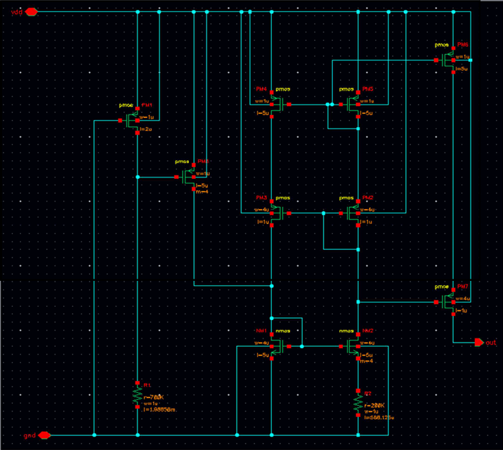
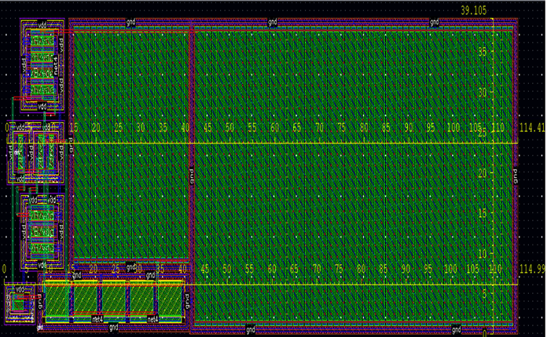
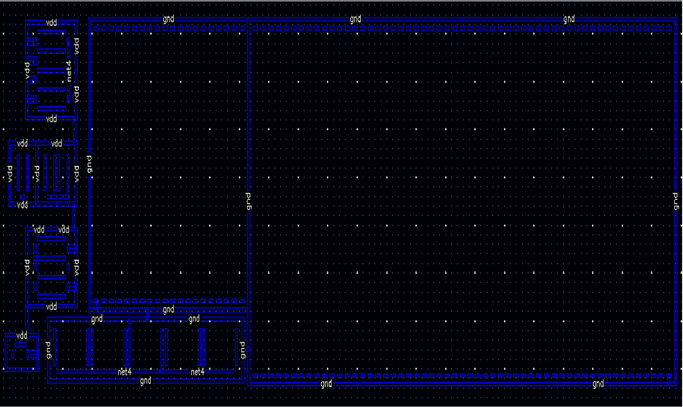
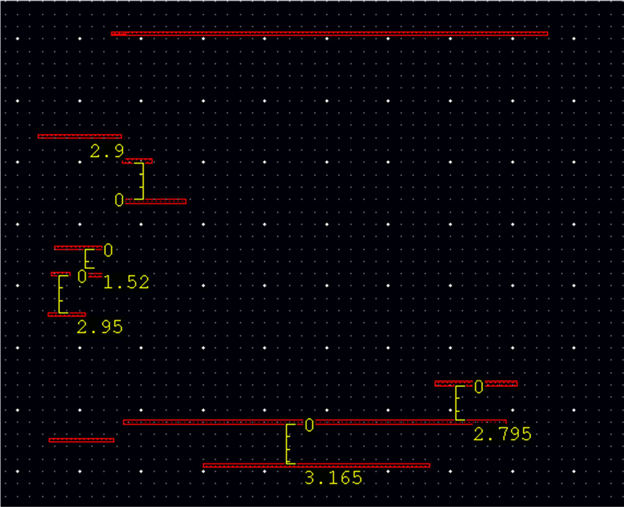
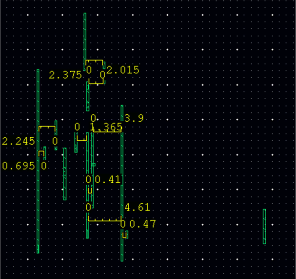
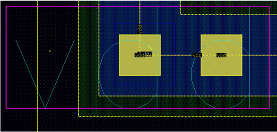
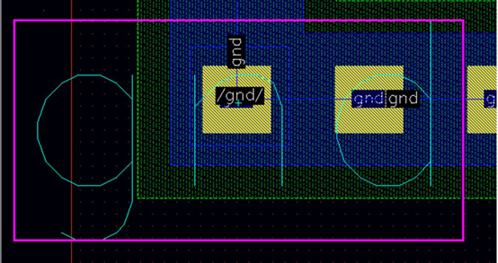
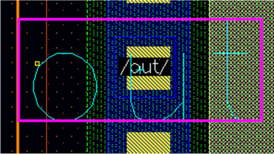
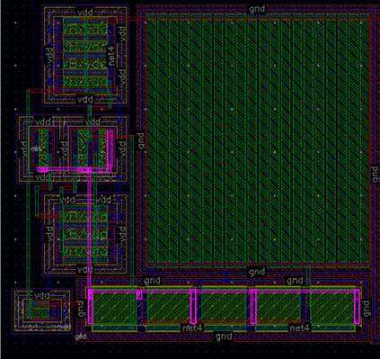

# Custom IC Layout of a Current Source

Custom IC layout implementation of a transistor-level current source in **Cadence Virtuoso**, developed as part of a university **team project**.

## Overview

This repository presents the layout implementation of a **transistor-level current source** realized in Cadence Virtuoso. The project was developed in a team-based academic setting, with work organized across multiple stages such as CAD, circuit design, layout, testing, technology, and project presentation.

My main contribution in the project was the **physical layout implementation** of the current-source cell. This included device placement, routing, pin definition, manual rule checking based on the project requirements, and visual schematic-to-layout correspondence for the main nets.

The repository documents both the schematic reference and the final layout results, together with representative images that highlight the implementation flow and the main layout decisions.

## Project Context

The project started from a transistor-level current-source schematic that had to be reproduced and implemented physically in Cadence Virtuoso. According to the project layout guidelines, the physical implementation had to respect area and geometry constraints, with the total layout area limited to **12,000 μm²** and the final shape required to be rectangular or square. :contentReference[oaicite:1]{index=1}

The layout task also required:
- pin definition on the proper metal-pin layers;
- manual checking of minimum spacing rules;
- and visual correspondence between selected schematic nets and their physical implementation in layout. :contentReference[oaicite:2]{index=2}

## My Role in the Team

This was a **team project**, but my main responsibility was the **layout stage**.

My work focused on:
- implementing the physical layout of the current-source circuit in Virtuoso;
- arranging the devices in a compact and readable structure;
- routing the main nets across the available metal layers;
- defining the layout pins correctly;
- verifying the required geometric spacing rules manually;
- and checking schematic-to-layout correspondence for the relevant nets.

Although the full project was collaborative, the layout implementation itself was primarily my responsibility.

## Layout Implementation

The starting point of the layout work was the transistor-level schematic of the current source. The final physical implementation was built around this schematic and organized to satisfy both connectivity and area constraints.

### Key implementation aspects
During layout development, attention was given to:
- compact device placement;
- readable organization of PMOS, NMOS, and resistive structures;
- efficient routing across multiple metal layers;
- correct pin definition for the main terminals;
- keeping the final structure within the imposed layout area.

The final layout shows a compact arrangement of the active devices and interconnect structure, together with a larger routed region that preserves the imposed rectangular organization. The complete layout and the total dimensions are visible in the final layout image. :contentReference[oaicite:3]{index=3}

### Placement strategy
The transistors were arranged using a mainly **east-west orientation**, which helped maintain a more structured geometry and improved routing consistency.

In addition, **source sharing** and **drain sharing** were used where appropriate in order to:
- reduce redundant routing;
- simplify local interconnect;
- improve compactness;
- and support a cleaner layout organization.

These choices were important from a practical layout perspective because they reduced unnecessary complexity while preserving the intended connectivity.

## Schematic Reference

The figure below shows the transistor-level schematic used as the reference for the layout implementation.

### Current Source Schematic

## Full Layout

The complete layout image includes the overall geometry and total dimensions of the implemented cell.

### Full Layout with Dimensions

## Metal Layer Usage

The implementation uses multiple routing layers, and the documentation includes overview images for the main metals used in the design.

### Metal 1 Overview
Metal 1 was used extensively for local routing and device-level connectivity.

### Metal 2 Overview
Metal 2 was used for additional interconnect and routing support between the main layout regions.

### Metal 3 Overview
Metal 3 was also used where needed to support higher-level routing organization.

## Pin Definition

An important part of the layout implementation was the correct definition of pins.  
According to the project guidelines, the pin type had to be changed from metal drawing to the appropriate **metal pin** layer, depending on the routing layer used. :contentReference[oaicite:4]{index=4}

This was necessary to ensure that the layout terminals were properly defined and matched the intended external connectivity of the cell.

The main pins highlighted in the implementation are:
- **VDD**
- **GND**
- **OUT**

### VDD Pin

### GND Pin

### OUT Pin

## Manual Rule Verification

The project required **manual verification** of the main geometric layout constraints rather than automatic DRC checking. The provided platform explicitly listed the minimum required distances for the relevant layers and regions. These included:  
- metal spacing ≥ **0.3 µm**
- nwell spacing ≥ **1.0 µm**
- pimp spacing ≥ **1.0 µm**
- nimp spacing ≥ **1.0 µm**
- poly spacing ≥ **0.3 µm**
- contact spacing ≥ **0.2 µm**. :contentReference[oaicite:5]{index=5}

In the project documentation, these rules were checked visually and supported by dedicated screenshots for:
- M1
- M2
- M3
- nwell
- pimp
- nimp
- poly
- contact spacing. :contentReference[oaicite:6]{index=6}

This manual verification process was part of the required implementation methodology and was used to confirm that the layout respected the expected geometric rules.

## Schematic-to-Layout Correspondence

Another important part of the project was the visual correspondence between the schematic and the implemented layout. This was done by highlighting selected nets and showing how the same connection is represented physically in the layout.

The project documentation includes multiple examples of this correspondence for nets such as:
- Net1
- Net2
- Net3
- Net4
- Net5
- Net7
- Net9
- OUT
- VDD
- GND

The example below illustrates one such highlighted net path.

### Example of Net Highlight / Schematic-to-Layout Correspondence

This step was important because it confirmed that the physical routing matched the intended circuit connectivity from the original schematic.

## What This Project Demonstrates

From a technical point of view, this project demonstrates:
- practical custom IC layout implementation in Cadence Virtuoso;
- device placement and floorplanning under area constraints;
- routing across multiple metal layers;
- correct pin creation and labeling;
- manual rule checking for important spacing constraints;
- schematic-to-layout correspondence;
- and layout-oriented thinking beyond simple schematic capture.

It also reflects an important part of IC design work: physical implementation is not only about drawing shapes, but about converting circuit intent into a manufacturable and traceable geometric structure.

## Tools Used

- **Cadence Virtuoso**
- custom IC layout workflow
- manual rule verification
- multi-layer routing
- pin definition and labeling
- schematic-to-layout visual verification

## Documentation

The repository includes the project documentation in PDF format, which contains:
- the schematic;
- the complete layout;
- layer-specific screenshots;
- spacing-rule illustrations;
- pin screenshots;
- and highlighted net correspondences.

## Notes

This repository is intended as a portfolio-style presentation of the layout work carried out for a transistor-level current source in a university team project.

The emphasis is placed on the **layout implementation**, which was my primary contribution within the broader team workflow.
